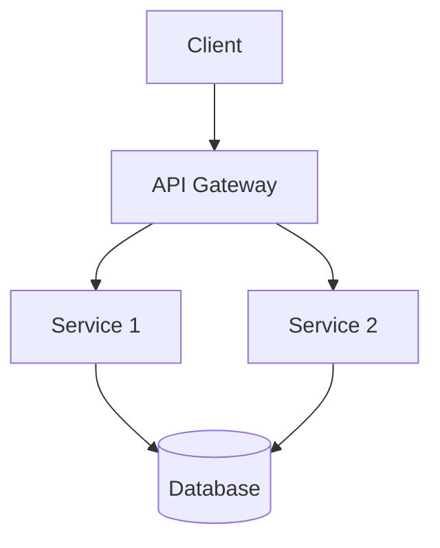

# Project Documentation Standardization Skill

## Purpose

This skill standardizes how documentation is created and maintained across projects. It defines file types, directory structures, templates, and conventions to ensure documentation is discoverable, consistent, and maintainable using docs-as-code principles.

---

## Core Philosophy

### Docs-as-Code

Treat documentation with the same rigor as software code:

- **Version control**: Documentation lives in Git alongside code
- **Plain text formats**: Markdown (`.md`) as the primary format
- **Code reviews**: Documentation changes via PRs
- **Automated workflows**: CI/CD integration for linting, link checking, building
- **Same repository**: Docs alongside code or in dedicated `/docs` directory

### Why This Matters

- Documentation stays current with code changes
- Teams can track, review, and revert documentation updates
- Reduces friction for contributors to update docs
- Ensures consistent quality and structure across all projects

---

## Essential Documentation Files

Every project MUST include these files at the repository root:

### 1. README.md

**Purpose**: Project overview and first entry point for visitors

**Required sections**:

```markdown
# Project Name

Brief description (1-2 sentences).

## Table of Contents

- [Features](#features)
- [Quick Start](#quick-start)
- [Installation](#installation)
- [Usage](#usage)
- [Documentation](#documentation)
- [Contributing](#contributing)
- [License](#license)

## Features

- Bullet list of key capabilities
- Focus on what it does, not how it's built
- Keep scannable

## Quick Start

Minimal working example to get users productive in <5 minutes:

```bash
# Installation command
npm install project-name

# Basic usage
project-name init
```

## Installation

Detailed setup instructions:

- Prerequisites
- Installation methods (multiple if applicable)
- Configuration basics

## Usage

- Common use cases with code examples
- Links to detailed guides
- API quick reference if applicable

## Documentation

Link to full documentation site or docs/ directory:

- [Getting Started Guide](./docs/getting-started.md)
- [API Reference](./docs/api.md)
- [Architecture](./docs/architecture.md)

## Contributing

Brief pointer to CONTRIBUTING.md:

> See [CONTRIBUTING.md](./CONTRIBUTING.md) for development setup, coding standards, and PR process.

## License

Link to LICENSE file with brief description:

This project is licensed under the MIT License - see the [LICENSE](./LICENSE) file for details.

## Contact

- Issues: [GitHub Issues](https://github.com/org/repo/issues)
- Email: team@example.com
```

**Best practices**:
- Keep it concise (aim for 1-3 screens on GitHub)
- Use badges for build status, version, license
- Include working code examples
- Don't duplicate GitHub metadata (description, topics)
- Move detailed content to dedicated docs/

**Anti-patterns to avoid**:
- Wall of text without formatting
- No working examples
- Hardcoded secrets in examples
- Outdated installation instructions
- Technical deep-dives (move to ARCHITECTURE.md)
- Duplicate information from GitHub metadata

### 2. CONTRIBUTING.md

**Purpose**: Onboard contributors and establish standards

**Required sections**:

```markdown
# Contributing to Project Name

Thanks for your interest in contributing! This guide covers the process and standards.

## Table of Contents

- [Code of Conduct](#code-of-conduct)
- [Getting Started](#getting-started)
- [Development Setup](#development-setup)
- [Workflow](#workflow)
- [Coding Standards](#coding-standards)
- [Testing](#testing)
- [Submitting Changes](#submitting-changes)
- [Reporting Bugs](#reporting-bugs)
- [Suggesting Features](#suggesting-features)

## Code of Conduct

This project adheres to a [Code of Conduct](CODE_OF_CONDUCT.md). By participating, you are expected to uphold this code.

## Getting Started

1. Fork the repository
2. Clone your fork: `git clone https://github.com/your-username/repo.git`
3. Create a branch: `git checkout -b feature/your-feature`
4. Make changes and commit following [Conventional Commits](https://www.conventionalcommits.org/)
5. Push to your fork and open a Pull Request

## Development Setup

### Prerequisites

- Node.js 20+ / Bun 1.0+ / [your toolchain]
- [Other dependencies]

### Installation

\`\`\`bash
git clone https://github.com/org/repo.git
cd repo
bun install
\`\`\`

### Environment Setup

\`\`\`bash
cp .env.example .env
# Edit .env with your credentials
\`\`\`

### Running Tests

\`\`\`bash
bun test
\`\`\`

### Running Locally

\`\`\`bash
bun dev
\`\`\`

## Workflow

1. **Create an issue first**: For significant changes, open an issue to discuss before coding
2. **Create a branch**: Use descriptive names: `feature/x`, `fix/y`, `docs/z`
3. **Write code**: Follow coding standards
4. **Write tests**: Include tests for new functionality
5. **Update docs**: Update documentation alongside code changes
6. **Submit PR**: Open a Pull Request against `main`

## Coding Standards

- Follow the project's style guide (link to CODING_STYLE.md or equivalent)
- Use [linter/type checker] (biome, eslint, TypeScript strict mode, etc.)
- Write self-documenting code with meaningful names
- Add comments for complex logic (why, not what)

## Testing

- All new features must include tests
- All bug fixes must include regression tests
- Run the full test suite before submitting: `bun test`
- Aim for meaningful coverage, not just percentage targets

## Submitting Changes

### Pull Request Checklist

- [ ] Tests pass locally: `bun test`
- [ ] Code follows style guidelines: `bun run lint`
- [ ] Documentation updated (README, docs/, inline comments)
- [ ] Commit messages follow [Conventional Commits](https://www.conventionalcommits.org/)
- [ ] PR description explains what and why

### Commit Message Format

\`\`\`
type(scope): description

[optional body]

[optional footer]
\`\`\`

Types: `feat`, `fix`, `docs`, `style`, `refactor`, `test`, `chore`

Examples:
- `feat(auth): add OAuth2 support`
- `fix(api): handle null values in user endpoint`
- `docs(readme): update installation instructions`

## Reporting Bugs

Before creating a bug report:

1. Check existing [issues](https://github.com/org/repo/issues) to avoid duplicates
2. Collect relevant information:
   - Environment (OS, runtime version, dependencies)
   - Steps to reproduce
   - Expected vs actual behavior
   - Logs, screenshots, or error messages

## Suggesting Features

Feature requests are welcome! Please provide:

- Clear description of the problem
- Proposed solution
- Alternatives considered
- Additional context or mockups

---

Thank you for contributing!
```

### 3. CHANGELOG.md

**Purpose**: Track notable changes for each release

Follow [Keep a Changelog](https://keepachangelog.com/en/1.1.0/) format:

```markdown
# Changelog

All notable changes to this project will be documented in this file.

The format is based on [Keep a Changelog](https://keepachangelog.com/en/1.1.0/),
and this project adheres to [Semantic Versioning](https://semver.org/spec/v2.0.0.html).

## [Unreleased]

### Added
- New feature in development

### Changed
- Changes to existing functionality

### Fixed
- Bug fixes

## [1.2.0] - 2024-01-15

### Added
- New feature description with context
- Additional capability

### Changed
- Updated behavior with rationale

### Deprecated
- Feature that will be removed in next major version

### Removed
- Features removed in this version

### Fixed
- Bug: specific issue resolved

### Security
- Security vulnerability patched

[Unreleased]: https://github.com/org/repo/compare/v1.2.0...HEAD
[1.2.0]: https://github.com/org/repo/compare/v1.1.0...v1.2.0
```

**Change categories**:
- **Added**: New features
- **Changed**: Changes in existing functionality
- **Deprecated**: Soon-to-be removed features
- **Removed**: Now removed features
- **Fixed**: Bug fixes
- **Security**: Vulnerability fixes

### 4. LICENSE

**Purpose**: Legal terms for code usage

Choose appropriate license:
- **MIT**: Permissive, simple
- **Apache 2.0**: Permissive with patent protection
- **GPL v3**: Copyleft, ensures derivative works remain open source
- **BSD**: Permissive with attribution requirements

Use [choosealicense.com](https://choosealicense.com/) to select the right license.

### 5. SECURITY.md

**Purpose**: Security policy and vulnerability reporting

```markdown
# Security Policy

## Supported Versions

| Version | Supported |
| ------- | --------- |
| 1.x.x   | ✅        |
| 0.x.x   | ❌        |

## Reporting a Vulnerability

If you discover a security vulnerability, please report it privately:

- **Email**: security@example.com
- **PGP Key**: [link to public key](link)
- **Bug Bounty**: [if applicable]

**Do NOT** open public GitHub issues for security vulnerabilities.

### What to Include

1. Description of the vulnerability
2. Steps to reproduce
3. Potential impact
4. Suggested fix (if any)

### Response Timeline

- **Initial response**: Within 48 hours
- **Status update**: Within 7 days
- **Fix timeline**: Depends on severity

## Security Best Practices for Contributors

[Project-specific security guidelines]

## Past Security Issues

[Link to CVE entries or security advisories if applicable]
```

### 6. CODE_OF_CONDUCT.md

**Purpose**: Community behavior standards

Use [Contributor Covenant](https://www.contributor-covenant.org/) as the standard template unless custom policy is required.

---

## Documentation Directory Structure

Organize detailed documentation in a `/docs` directory:

```
project/
├── README.md                 # Project overview + quick start
├── CONTRIBUTING.md           # Contribution guidelines
├── CHANGELOG.md              # Version history
├── LICENSE                   # Legal terms
├── SECURITY.md               # Security policy
├── CODE_OF_CONDUCT.md        # Community standards
│
└── docs/                     # Detailed documentation
    ├── index.md              # Documentation landing page
    ├── getting-started/      # Tutorials and setup guides
    │   ├── installation.md
    │   ├── quickstart.md
    │   └── first-project.md
    ├── guides/               # How-to guides
    │   ├── authentication.md
    │   ├── deployment.md
    │   └── troubleshooting.md
    ├── reference/            # Technical reference
    │   ├── api/              # API documentation
    │   │   ├── overview.md
    │   │   ├── authentication.md
    │   │   ├── endpoints.md
    │   │   └── errors.md
    │   ├── cli.md            # Command-line reference
    │   └── configuration.md  # Configuration options
    ├── concepts/             # Conceptual explanations
    │   ├── architecture.md   # System design
    │   ├── data-model.md     # Data structures
    │   └── security-model.md # Security architecture
    └── adr/                  # Architecture Decision Records
        ├── README.md
        ├── template.md
        └── ADR-001-decision-name.md
```

**Principles**:
- **Flat over deep**: Don't nest more than 2 levels
- **Name by topic**: `authentication.md`, not `guide-auth-v2.md`
- **One concept per file**: Long multi-topic pages are unsearchable
- **Landing pages per section**: Each folder gets an `index.md`

---

## Documentation File Types

### Architecture Documentation

**File**: `docs/concepts/architecture.md` or `ARCHITECTURE.md`

**Purpose**: System design, components, and data flow

**Standard sections**:

```markdown
# Architecture

## Overview

2-3 sentence summary of the system purpose and design approach.

## System Context

[Use C4 Model Level 1: System Context Diagram]

What external systems does this interact with?

- **External Service A**: Purpose
- **Database B**: Data storage
- **Message Queue C**: Async communication

## Components

[Use C4 Model Level 2: Container/Component Diagram]

### [Component 1]

**Responsibility**: What this component does

**Technologies**: Language, frameworks, libraries

**Interfaces**: APIs, protocols, data formats

**Dependencies**: What it depends on

### [Component 2]

[Repeat structure]

## Data Flow

[Use Mermaid diagrams for flow visualization]

\`\`\`mermaid
sequenceDiagram
    User->>API: Request
    API->>Service: Process
    Service->>Database: Query
    Database-->>Service: Result
    Service-->>API: Response
    API-->>User: Response
\`\`\`

## Design Decisions

Key architectural choices and rationale (link to ADRs for details).

## Non-Functional Requirements

- **Performance**: Latency targets, throughput
- **Scalability**: Growth strategy
- **Security**: Threat model, authentication, authorization
- **Reliability**: Uptime targets, disaster recovery
- **Observability**: Logging, metrics, tracing

## Future Considerations

Known limitations and planned improvements.
```

### API Documentation

**File**: `docs/reference/api/overview.md`, `endpoints.md`

**Purpose**: API reference for developers

**Standard sections per endpoint**:

```markdown
# [Resource Name]

## Overview

Brief description of the resource and its purpose.

## Authentication

How to authenticate requests.

\`\`\`http
Authorization: Bearer {token}
\`\`\`

## Base URL

\`\`\`
https://api.example.com/v1
\`\`\`

## [Endpoint Name]

### HTTP Request

\`\`\`http
POST /api/v1/resource HTTP/1.1
Host: api.example.com
Authorization: Bearer {token}
Content-Type: application/json

{
  "field": "value"
}
\`\`\`

### Path Parameters

| Parameter | Type | Required | Description |
| --------- | ---- | -------- | ----------- |
| `id` | string | Yes | Resource identifier |

### Query Parameters

| Parameter | Type | Required | Description |
| --------- | ---- | -------- | ----------- |
| `limit` | integer | No | Results per page (default: 20, max: 100) |
| `offset` | integer | No | Pagination offset |

### Request Body

\`\`\`json
{
  "name": "string",
  "email": "string",
  "metadata": {
    "key": "value"
  }
}
\`\`\`

### Response

#### Success (200 OK)

\`\`\`json
{
  "id": "123",
  "name": "string",
  "created_at": "2024-01-15T10:30:00Z"
}
\`\`\`

#### Error Responses

| Status Code | Error Type | Description |
| ------------ | ---------- | ----------- |
| 400 | Bad Request | Invalid input |
| 401 | Unauthorized | Invalid or missing authentication |
| 403 | Forbidden | Insufficient permissions |
| 404 | Not Found | Resource doesn't exist |
| 429 | Too Many Requests | Rate limit exceeded |
| 500 | Internal Server Error | Server error |

### Examples

\`\`\`bash
curl -X POST https://api.example.com/v1/resource \\
  -H "Authorization: Bearer {token}" \\
  -H "Content-Type: application/json" \\
  -d '{"name": "Example"}'
\`\`\`
```

### CLI Reference

**File**: `docs/reference/cli.md`

**Purpose**: Command-line interface documentation

**Standard structure**:

```markdown
# CLI Reference

## Installation

[How to install the CLI tool]

## Usage

\`\`\`bash
project-name [command] [flags]
\`\`\`

## Commands

### `project-name init`

Initialize a new project.

\`\`\`bash
project-name init [project-name] [flags]
\`\`\`

**Flags**:
- `-t, --template`: Project template (default: "default")
- `-f, --force`: Overwrite existing files

**Example**:
\`\`\`bash
project-name init my-app --template react
\`\`\`

### `project-name build`

Build the project.

[Continue for each command...]

## Global Flags

- `-h, --help`: Show help
- `-v, --version`: Show version
- `--verbose`: Enable verbose output

## Environment Variables

| Variable | Description | Default |
| -------- | ----------- | ------- |
| `PROJECT_ENV` | Environment mode | `development` |
| `API_KEY` | API authentication key | None |
```

### Configuration Documentation

**File**: `docs/reference/configuration.md`

**Purpose**: Configuration options and environment variables

**Standard structure**:

```markdown
# Configuration

## Environment Variables

| Variable | Type | Required | Default | Description |
| --------- | ---- | -------- | ------- | ----------- |
| `NODE_ENV` | string | No | `development` | Runtime environment |
| `PORT` | integer | No | `3000` | Server port |
| `DATABASE_URL` | string | Yes | - | Database connection string |
| `API_KEY` | string | Yes | - | External API key |

## Configuration File

### `config.yaml`

\`\`\`yaml
server:
  port: 3000
  host: "0.0.0.0"

database:
  url: ${DATABASE_URL}
  pool_size: 10

features:
  experimental: false
  cache: true
\`\`\`

### Options

**server.port** (integer, default: 3000)
HTTP server port.

**server.host** (string, default: "0.0.0.0")
Server bind address.

**database.url** (string, required)
PostgreSQL connection string. Set via `DATABASE_URL` environment variable.

**database.pool_size** (integer, default: 10)
Database connection pool size.

**features.experimental** (boolean, default: false)
Enable experimental features.

**features.cache** (boolean, default: true)
Enable response caching.

## Configuration Precedence

1. Environment variables (highest priority)
2. Configuration file
3. Default values (lowest priority)
```

### Architecture Decision Records (ADRs)

**Directory**: `docs/adr/`

**Purpose**: Capture significant architectural decisions with context and consequences

**Template** (`docs/adr/template.md`):

```markdown
# ADR-NNN: Decision Title

- **Status**: Proposed | Accepted | Deprecated | Superseded by ADR-XXX
- **Date**: YYYY-MM-DD
- **Deciders**: Names/roles

## Context

What is the issue we're facing? What forces are at play?

Include:
- Business requirements
- Technical constraints
- Team expertise
- Time/resource limitations
- External dependencies

## Decision

What decision are we making? Be specific and concise.

## Alternatives Considered

### Alternative 1: [Name]

**Description**: What this approach entails

**Pros**:
- Advantage 1
- Advantage 2

**Cons**:
- Disadvantage 1
- Disadvantage 2

**Why not chosen**: Explanation

[Repeat for each alternative]

## Consequences

### Positive

- Benefit 1
- Benefit 2

### Negative

- Trade-off 1
- Trade-off 2

### Neutral

- Other consequence 1

## Implementation Notes

[Optional] How will this be implemented?

## References

- Related ADRs
- Research links
- Discussion threads
```

**File naming**: `ADR-NNN-brief-description.md` (e.g., `ADR-001-use-postgresql.md`)

### Runbooks / Operational Docs

**File**: `docs/guides/runbooks/[topic].md`

**Purpose**: Operational procedures for on-call and DevOps

**Standard structure**:

```markdown
# Runbook: [Service/Topic Name]

## Overview

Brief description of this runbook's purpose.

## Prerequisites

- Access to [systems]
- [Tools/credentials required]

## Common Operations

### [Operation 1]

**Symptoms**: When to perform this operation

**Steps**:
1. Step one
2. Step two
3. Verify with: `command`

**Expected outcome**: What success looks like

### [Operation 2]

[Repeat structure]

## Troubleshooting

### Issue: [Common Problem]

**Symptoms**: Observable indicators

**Diagnosis**:
1. Check [metric/log]
2. Run [diagnostic command]

**Resolution**:
1. Remediation step
2. Prevention measure

## Escalation

If unable to resolve within [timeframe]:

- **Primary contact**: @team-name
- **Secondary contact**: @team-name
- **Slack channel**: #team-oncall
```

### Design Documents

**File**: `docs/design/[feature-name].md`

**Purpose**: Feature design proposals and specifications

**Standard structure**:

```markdown
# Design Doc: [Feature Name]

**Status**: Draft | In Review | Approved | Implemented
**Author**: Name
**Reviewers**: Names
**Date**: YYYY-MM-DD

## Summary

Brief description of the proposed change.

## Background

Why are we making this change? What problem does it solve?

## Goals

- Goal 1
- Goal 2

## Non-Goals

- Out of scope item 1
- Out of scope item 2

## Proposed Solution

### Architecture

[Diagrams, component descriptions]

### API Design

[Endpoint specifications, data models]

### Data Model

[Schema changes, migrations]

### Security Considerations

- Authentication requirements
- Authorization model
- Data handling

### Performance Impact

- Expected performance characteristics
- Load testing results

## Alternatives Considered

[Brief comparison of alternatives]

## Implementation Plan

### Milestones

1. [Milestone 1]: [Date]
2. [Milestone 2]: [Date]

### Tasks

- [ ] Task 1
- [ ] Task 2

## Open Questions

- [ ] Question 1
- [ ] Question 2

## Success Metrics

How will we measure success?

- Metric 1: Target value
- Metric 2: Target value
```

### Testing Documentation

**File**: `docs/testing/strategy.md`

**Purpose**: Testing approach, standards, and guidelines

**Standard sections**:

```markdown
# Testing Strategy

## Overview

Testing philosophy and approach for this project.

## Test Pyramid

[Diagram showing unit/integration/e2e test distribution]

## Unit Tests

### Location

Co-located with source code: `src/foo/foo.test.ts`

### Coverage Target

- **Minimum**: 80%
- **Target**: 90%

### Running Unit Tests

\`\`\`bash
bun test
\`\`\`

## Integration Tests

### Location

`tests/integration/`

### Running Integration Tests

\`\`\`bash
bun test:integration
\`\`\`

## E2E Tests

### Location

`tests/e2e/`

### Running E2E Tests

\`\`\`bash
bun test:e2e
\`\`\`

## Test Writing Guidelines

- One behavior per test
- Use descriptive test names: `it('should return 404 when user not found')`
- Follow AAA pattern: Arrange, Act, Assert
- Mock external dependencies
- Test edge cases and error paths
```

### Postmortems / Retrospectives

**File**: `docs/postmortems/YYYY-MM-DD-incident-name.md`

**Purpose**: Document incidents and learnings

**Standard structure**:

```markdown
# Postmortem: [Incident Name]

- **Date**: YYYY-MM-DD
- **Author**: Name
- **Status**: Draft | Final
- **Severity**: SEV-1 | SEV-2 | SEV-3

## Executive Summary

[2-3 sentence overview of what happened and impact]

## Timeline

| Timestamp (UTC) | Event |
| --------------- | ----- |
| HH:MM | First alert fired |
| HH:MM | On-call paged |
| HH:MM | Root cause identified |
| HH:MM | Resolution implemented |
| HH:MM | Service restored |

## Root Cause

[Technical explanation of what caused the incident]

## Impact

- **Duration**: X minutes/hours
- **Users affected**: Estimate
- **Services affected**: List
- **Data loss**: Yes/No, details

## Resolution

What was done to fix the issue?

## Lessons Learned

### What Went Well

- Positive observation 1
- Positive observation 2

### What Went Wrong

- Issue 1
- Issue 2

### Where We Got Lucky

- Observation 1

## Action Items

| Action | Owner | Priority | Due Date |
| ------- | ----- | -------- | -------- |
| Add monitoring for X | @name | P0 | YYYY-MM-DD |
| Update runbook | @name | P1 | YYYY-MM-DD |
```

---

## Documentation Standards

### Markdown Conventions

Use GitHub Flavored Markdown (GFM) with these rules:

**Headings**:
- Use ATX-style (`#`) headings only
- Start with `#` for H1, don't skip levels
- Title case for H1, sentence case for H2-H6

**Lists**:
- Use `-` for unordered lists (consistent throughout)
- Use `1.` for ordered lists
- Indent nested items with 2 or 4 spaces

**Code**:
- Always specify language for code blocks: ` ```typescript `
- Inline code with backticks: `variable_name`
- Use relative paths for local links

**Links**:
- Use descriptive link text: `[Contributing Guide](./CONTRIBUTING.md)`
- Avoid "click here" or "here"
- Use relative paths within repo, absolute URLs for external

**Tables**:
- Keep tables simple and scannable
- Align columns for readability
- Use `| --- |` separator after header

### File Naming

- **Lowercase with hyphens**: `getting-started.md`, `api-reference.md`
- **Consistent case**: Don't mix `README.md` and `readme.md`
- **Descriptive**: `authentication.md`, not `auth-guide-v2.md`
- **No version numbers in filenames**: Handle versioning in content or directory structure

### Linking Best Practices

- **Internal links**: Use relative paths (`./guide.md`, `../reference/api.md`)
- **External links**: Use absolute URLs with descriptive text
- **Cross-references**: Link to related docs explicitly
- **Broken links**: Set up automated link checking in CI

### Diagrams

Use Mermaid for text-based diagrams (renders natively on GitHub):

```markdown

```

**When to use**:
- Architecture overviews (C4 model diagrams)
- Data flow visualizations
- Sequence diagrams for workflows
- State machine diagrams

**Mermaid diagram types**:
- `graph TD/LR`: Flowcharts
- `sequenceDiagram`: Sequence diagrams
- `classDiagram`: Class diagrams
- `erDiagram`: Entity-relationship diagrams
- `stateDiagram-v2`: State machines

### Frontmatter (Optional)

Use YAML frontmatter for metadata in docs files:

```markdown
---
title: Authentication Guide
description: How to authenticate API requests
sidebar_position: 2
---

# Authentication
```

---

## Maintenance Practices

### Keeping Docs Current

1. **Docs with code changes**: Update documentation in the same PR as code changes
2. **Quarterly audits**: Review docs for accuracy, update as needed
3. **Stale detection**: Flag docs not updated in X months
4. **Link checking**: Automated link validation in CI
5. **Docs owner**: Assign CODEOWNERS for docs sections

### Documentation as Definition of Done

A PR is not complete until:
- [ ] Code changes are implemented
- [ ] Tests pass
- [ ] Documentation is updated
- [ ] Docs are reviewed (if substantial)

### Automation

**CI/CD integration**:
- Lint markdown files (markdownlint, Vale)
- Check for broken links
- Build documentation site (MkDocs, Docusaurus, etc.)
- Spell checking
- Link validation

**Tools**:
- **Markdown linting**: `markdownlint`, `vale`
- **Link checking**: `markdown-link-check`
- **Documentation generators**: MkDocs, Docusaurus, Sphinx
- **API docs**: OpenAPI/Swagger generators

---

## Documentation Checklist

Use this checklist when creating or reviewing documentation:

### For All PRs

- [ ] README updated if user-facing behavior changed
- [ ] Relevant docs/ files updated
- [ ] Links work correctly
- [ ] Code examples are tested and working
- [ ] Terminology is consistent with existing docs

### For New Features

- [ ] Feature documented in user-facing docs
- [ ] API changes documented
- [ ] Configuration options documented
- [ ] Examples provided
- [ ] Migration guide if breaking changes

### For Architecture Decisions

- [ ] ADR created for significant decisions
- [ ] ADR includes context, decision, alternatives, consequences
- [ ] Architecture diagrams updated

---

## Common Documentation Anti-Patterns

❌ **Wall of text**: Long paragraphs without headings or formatting
❌ **Missing examples**: Every concept needs at least one runnable example
❌ **Outdated content**: Docs that don't match current behavior
❌ **Jargon overload**: Assuming reader expertise without context
❌ **Inconsistent terminology**: "Project" on one page, "workspace" on another
❌ **Broken links**: Link to non-existent or moved content
❌ **No troubleshooting**: Missing common problems and solutions
❌ **Copy-paste examples**: Without explanation of what they do

---

## Templates Reference

This skill includes templates for:

- [README.md Template](./templates/README.md)
- [CONTRIBUTING.md Template](./templates/CONTRIBUTING.md)
- [SECURITY.md Template](./templates/SECURITY.md)
- [API Endpoint Template](./templates/api-endpoint.md)
- [Architecture Doc Template](./templates/architecture.md)
- [ADR Template](./templates/adr.md)
- [Design Doc Template](./templates/design-doc.md)
- [Postmortem Template](./templates/postmortem.md)
- [Runbook Template](./templates/runbook.md)

---

## References

- [Google Style Guide - READMEs](https://github.com/google/styleguide/blob/gh-pages/docguide/READMEs.md)
- [Keep a Changelog](https://keepachangelog.com/en/1.1.0/)
- [Contributor Covenant](https://www.contributor-covenant.org/)
- [Standard README](https://github.com/RichardLitt/standard-readme)
- [arc42 Architecture Documentation](https://arc42.org/)
- [C4 Model](https://c4model.com/)
- [Docs as Code](https://www.writethedocs.org/guide/docs-as-code/)
- [OpenAPI Specification](https://swagger.io/specification/)
