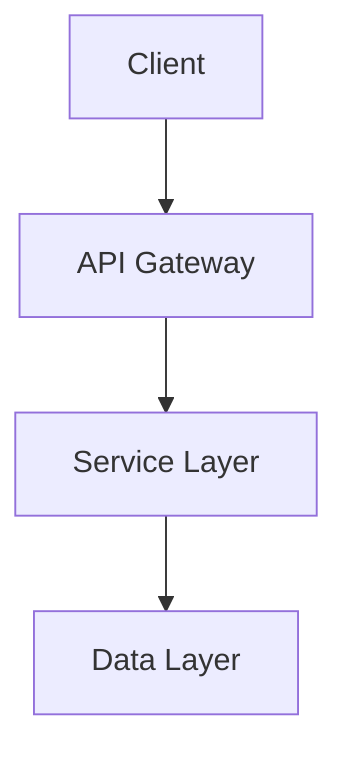

# Project Name

Brief description (1-2 sentences) explaining what this project does and why it matters.

> **Status**: [Beta | Stable | Alpha | Deprecated] | **Version**: [x.y.z] | **License**: [MIT | Apache 2.0 | etc.]

## Table of Contents

- [Features](#features)
- [Quick Start](#quick-start)
- [Installation](#installation)
- [Usage](#usage)
- [Documentation](#documentation)
- [Contributing](#contributing)
- [License](#license)

## Features

- Feature 1: Brief description
- Feature 2: Brief description
- Feature 3: Brief description

Focus on **what it does** and **why it matters**, not implementation details.

## Quick Start

Get up and running in under 5 minutes:

```bash
# Install
npm install project-name

# Initialize
project-name init

# Run
project-name start
```

For detailed instructions, see [Installation](#installation).

## Installation

### Prerequisites

Before installing, ensure you have:

- [Prerequisite 1]: Version requirement and installation link
- [Prerequisite 2]: Version requirement and installation link

### Install via Package Manager

```bash
# npm
npm install project-name

# yarn
yarn add project-name

# bun
bun add project-name
```

### From Source

```bash
git clone https://github.com/org/repo.git
cd repo
bun install
bun build
```

### Environment Configuration

```bash
# Copy environment template
cp .env.example .env

# Edit with your credentials
vim .env
```

Required environment variables:

| Variable | Description | Required |
| -------- | ----------- | -------- |
| `API_KEY` | API authentication key | Yes |
| `DATABASE_URL` | Database connection string | Yes |
| `PORT` | Server port (default: 3000) | No |

## Usage

### Basic Example

```typescript
import { Client } from "project-name";

const client = new Client({
  apiKey: process.env.API_KEY,
});

// Use the client
const result = await client.doSomething();
```

### Advanced Configuration

```typescript
const client = new Client({
  apiKey: process.env.API_KEY,
  options: {
    timeout: 5000,
    retries: 3,
    logLevel: "debug",
  },
});
```

For more examples, see [Usage Examples](./docs/guides/examples.md).

## Documentation

- [Getting Started Guide](./docs/getting-started.md) — Detailed setup walkthrough
- [API Reference](./docs/reference/api.md) — Complete API documentation
- [Architecture](./docs/concepts/architecture.md) — System design and data flow
- [CLI Reference](./docs/reference/cli.md) — Command-line interface guide
- [Configuration](./docs/reference/configuration.md) — All configuration options
- [Contributing](./CONTRIBUTING.md) — Development setup and contribution guide
- [Changelog](./CHANGELOG.md) — Version history

## Architecture

This project follows a modular architecture:



For details, see [Architecture](./docs/concepts/architecture.md).

## Contributing

We welcome contributions! Please see [CONTRIBUTING.md](./CONTRIBUTING.md) for:

- Development setup
- Coding standards
- Testing requirements
- Pull request process

## Code of Conduct

This project adheres to a [Code of Conduct](CODE_OF_CONDUCT.md). By participating, you are expected to uphold this code.

## License

This project is licensed under the [MIT License](LICENSE) — see the [LICENSE](LICENSE) file for details.

## Contact

- **Issues**: [GitHub Issues](https://github.com/org/repo/issues)
- **Discussions**: [GitHub Discussions](https://github.com/org/repo/discussions)
- **Email**: team@example.com

---

**Badges** (add these after the title):

```markdown


```
